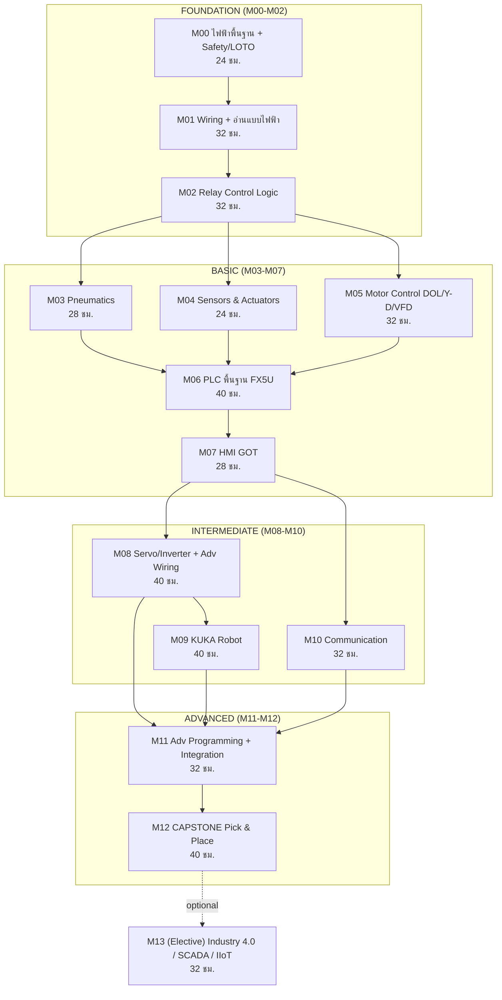

# เอกสารภาพรวมหลักสูตรหลัก (Master Curriculum Overview)
## หลักสูตร "Industrial Mechatronics Practitioner"
### หลักสูตรฝึกอบรมเชิงปฏิบัติ พัฒนาช่างไฟฟ้าและช่างซ่อมบำรุงในโรงงานอุตสาหกรรม

> เอกสารฉบับนี้จัดทำโดย Lead Curriculum Designer เพื่อใช้นำเสนอและเป็นแผนแม่บทในการพัฒนาหลักสูตรจริง
> วันที่จัดทำ: 30 มิถุนายน 2026

---

## สารบัญ
1. [บทนำและปรัชญาหลักสูตร](#1-บทนำและปรัชญาหลักสูตร)
2. [กลุ่มเป้าหมายและเส้นทางการเรียน](#2-กลุ่มเป้าหมายและเส้นทางการเรียน-learning-paths)
3. [ตารางสรุปโมดูลและแผนภาพลำดับการเรียน](#3-ตารางสรุปโมดูลและแผนภาพลำดับการเรียน)
4. [สิ่งที่เปลี่ยน/เพิ่มจากลิสต์เดิม และเหตุผล](#4-สิ่งที่เปลี่ยนเพิ่มจากลิสต์เดิม-และเหตุผล)
5. [ผลลัพธ์ที่ผู้เรียนได้เมื่อจบ (Learning Outcomes)](#5-ผลลัพธ์ที่ผู้เรียนได้เมื่อจบ-learning-outcomes)
6. [ข้อเสนอแนะและแผนพัฒนาจาก Gap Analysis](#6-ข้อเสนอแนะและแผนพัฒนาจาก-gap-analysis)
7. [ขั้นตอนถัดไปสำหรับการเริ่มสร้างหลักสูตรจริง](#7-ขั้นตอนถัดไปสำหรับการเริ่มสร้างหลักสูตรจริง)

---

## 1. บทนำและปรัชญาหลักสูตร

### 1.1 ภาพรวม
หลักสูตร **"Industrial Mechatronics Practitioner"** เป็นหลักสูตรเชิงปฏิบัติ (hands-on first) ที่ออกแบบเพื่อพาผู้เรียนจาก **zero (ไม่มีความรู้ไฟฟ้าเลย)** ไปสู่ระดับ **expert ที่ทำงานจริงในโรงงานได้** — เทียบเท่าผู้จบสาขา Mechatronics แต่ตัดทฤษฎีเชิงวิชาการที่ไม่จำเป็นออก และทุ่มเวลาให้กับทักษะที่ใช้หน้างานจริง

| รายการ | รายละเอียด |
|---|---|
| ชื่อหลักสูตร | Industrial Mechatronics Practitioner |
| เป้าหมาย | zero → expert ทำงานจริงได้ เทียบเท่าจบ Mechatronics (เน้นปฏิบัติ) |
| จำนวนโมดูลหลัก (core) | 13 โมดูล (M00–M12) |
| ชั่วโมงรวม core | ~396 ชั่วโมง (~50 วันทำการ หรือ ~6 เดือนแบบ part-time) |
| โมดูล elective | M13 (อีก ~24–32 ชั่วโมง) |
| อัตราส่วน ทฤษฎี : ปฏิบัติ | 30 : 70 |
| Capstone | เครื่อง Pick & Place เต็มระบบ (PLC + HMI + Servo + Robot + Communication) |
| รูปแบบการสอน | **Online เป็นแกน + Remote Lab (คุมเครื่องจริงทางไกล ฟรี)**, Offline พรีเมียมสำหรับทักษะมือ, On-site ต่างจังหวัด/corporate, Hybrid |

### 1.2 แพลตฟอร์มหลัก (Platform Stack)
| ระบบ | แพลตฟอร์ม / เครื่องมือ |
|---|---|
| PLC | Mitsubishi **FX5U / iQ-F** (ซอฟต์แวร์ **GX Works3**) |
| HMI | Mitsubishi **GOT2000** (ซอฟต์แวร์ **GT Designer3 / GT Works3**) |
| Robot | **KUKA** (ภาษา **KRL**, สั่งงานผ่าน **smartPAD**, KSS 8.x) |
| Servo / Inverter | Mitsubishi **MELSERVO** (MR-JE-A / MR-J4 / MR-J5) + **FR series** inverter |
| Communication | **Modbus** (RTU/TCP) / **Ethernet** / **CC-Link IE Field** |
| **Remote Lab (ส่งมอบออนไลน์)** | เครื่องจริงต่อเครือข่าย + กล้องหลายมุม + remote access + safety คุมทางไกล — ผู้เรียนออนไลน์ **เขียน/รันบน PLC/HMI/servo/robot จริง** (ดูสเปกใน A §จ, การจัดสอนใน D §1.3) |

### 1.3 ปรัชญาหลักสูตร (4 เสาหลัก)

**เสาที่ 1 — "ทักษะมือต้องมาก่อนโค้ด" (Hands-on First)**
ผู้เรียนต้องต่อสาย วัดไฟ และเข้าใจ relay logic ทางกายภาพ **ก่อน** แตะ PLC เพราะ ladder logic คือ relay logic ในรูปแบบ software ใครเข้าใจรีเลย์จริง จะเขียน ladder ได้อย่างมีความหมาย ไม่ใช่ท่องจำ

**เสาที่ 2 — "Theory just-in-time"**
สอนทฤษฎีเท่าที่ต้องใช้ทันที ไม่ท่วมหัวด้วยคณิตศาสตร์เชิงวิชาการ ทุกแนวคิดทฤษฎีผูกกับงานจริงที่จะทำในแล็บถัดไปทันที

**เสาที่ 3 — "Skill Scaffolding" (ต่อยอดเป็นชั้น ห้ามข้ามขั้น)**
> ทักษะมือ (wiring) → logic ทางกายภาพ (relay) → logic ทาง software (PLC) → การบูรณาการ (integration)

ห้ามข้ามจาก relay ไป PLC โดยตรง และห้ามสอน wiring servo/robot ก่อนเรียน PLC เพราะจะ test ไม่ได้และไม่เห็นภาพ

**เสาที่ 4 — "Spiral Curriculum + Project-based"**
แนวคิด **ความปลอดภัย, การอ่านแบบไฟฟ้า, documentation** วนกลับมาย้ำทุกโมดูล (ไม่ใช่สอนครั้งเดียวจบ) และทุกโมดูลจบด้วย **ชิ้นงาน/mini-project ที่จับต้องได้** ซึ่งค่อย ๆ ต่อจิ๊กซอว์เข้าหา Capstone Pick & Place

### 1.4 รูปแบบการส่งมอบ (Delivery Model)

หลักสูตรส่งมอบแบบ **Online เป็นแกนหลัก** โดยมี **Remote Lab** เป็นตัวทำให้ "เสาที่ 1 (Hands-on First)" ยังเป็นจริงในโหมดออนไลน์ — ผู้เรียนต่อออนไลน์เข้ามา **เขียนโปรแกรม PLC/HMI/servo/robot บนเครื่องจริง ดูผลผ่านกล้องสด** ไม่ใช่แค่ simulator

| โหมด | บทบาท |
|---|---|
| **① Online + Remote Lab (แกน)** | ทฤษฎี + โมดูลเขียนโปรแกรม (M06–M13) บนเครื่องจริงทางไกล — เข้าถึงทั่วประเทศ ต้นทุนต่อหัวต่ำ |
| **② Offline / In-person (พรีเมียม)** | ทักษะมือที่ทางไกลแทนไม่ได้ (wiring, crimp, LOTO, ประกอบตู้, ต่อ servo/robot) — M00–M05 + งาน wiring |
| **③ On-site / ต่างจังหวัด** | ทีม + ชุดอุปกรณ์เคลื่อนที่ไปสอนถึงโรงงาน/สถาบัน (corporate/กลุ่ม) |
| **④ Hybrid** | Online (โปรแกรม) + block on-site (ทักษะมือ) — ครบวงจร ยืดหยุ่น |

> **เส้นแบ่ง:** "เขียน/สั่ง/ดู" ทำทางไกลได้ผ่าน Remote Lab — "จับ/ต่อ/วัด" ต้องหน้าเครื่อง (โหมด ②/④) · รายละเอียดการจัดสอนดู **D §1.2–1.6**, สเปกอุปกรณ์ดู **A §จ**

---

## 2. กลุ่มเป้าหมายและเส้นทางการเรียน (Learning Paths)

### 2.1 กลุ่มเป้าหมาย (Personas)

| Persona | พื้นฐานเดิม | เป้าหมาย |
|---|---|---|
| **A. ช่างใหม่ไม่มีพื้นฐาน** (Fresh / Career Changer) | จบ ม.6/ปวช. สายอื่น หรือเปลี่ยนสายงาน ไม่เคยจับงานไฟฟ้า ไม่รู้จัก Ohm's law หรือการต่อสาย — เริ่มจากศูนย์จริง | มีอาชีพเป็นช่างไฟฟ้า/ช่างซ่อมบำรุงในโรงงาน เรียนครบ M00 จนจบ Capstone เพื่อเข้าทำงานได้ทันที |
| **B. ช่างไฟมีพื้นฐาน** (อยากต่อยอด PLC/Automation) | เดินสาย ต่อ motor control เป็น เข้าใจ relay/contactor แต่ไม่เคยเขียน PLC, HMI หรือคุม servo/robot | ยกระดับเป็น automation technician เน้น M05–M12, test-out โมดูล Foundation ได้ |
| **C. ช่างซ่อมบำรุงอยากครบสาย** (Maintenance All-rounder) | ดูแลเครื่องในไลน์ผลิต แก้เฉพาะหน้าได้บ้าง แต่ความรู้กระจัดกระจาย ขาดระบบ troubleshoot | เข้าใจระบบทั้งสายแบบมีโครงสร้าง troubleshoot เป็นระบบ อ่าน drawing เป็น ซ่อม automation ที่ซับซ้อนได้เอง |
| **D. วิศวกร/หัวหน้างาน** (upskill ทีม) | มีทฤษฎีแต่ขาด hands-on กับ Mitsubishi/KUKA โดยเฉพาะ | ใช้หลักสูตรเป็น reference upskill ทีม เรียนเฉพาะ Intermediate/Advanced เพื่อคุมงาน integration + วาง maintenance plan |

### 2.2 เส้นทางลัดตาม Persona (Test-out / Skip Path)

| Persona | เส้นทางแนะนำ |
|---|---|
| **A. ช่างใหม่** | เรียนเต็ม **M00 → M13** ตามลำดับ ไม่ข้ามขั้น |
| **B. ช่างไฟมีพื้นฐาน** | สอบ **test-out M00–M01** ได้ → เริ่มจริงที่ **M02/M05** → ลุย **M06** เป็นต้นไป |
| **C. ช่างซ่อมบำรุง** | **M00 (safety refresh)** → fast-track ผ่าน **M04–M05** → เน้นหนัก **M08–M12** โดยเฉพาะแกน troubleshooting ใน M12 |
| **D. วิศวกร/หัวหน้างาน** | ใช้ **M00–M05 เป็น reference** → ลงลึก **M06–M13** เพื่อคุมงาน integration |

> **หมายเหตุ:** ผู้เรียนที่ขอ test-out ต้องผ่านการสอบ gate ปฏิบัติของระดับนั้น ๆ (ดู checklist เกณฑ์ผ่านในข้อ 5) ก่อนข้ามโมดูล — เพื่อกันการเรียนข้ามขั้นแบบมั่ว

---

## 3. ตารางสรุปโมดูลและแผนภาพลำดับการเรียน

### 3.1 ตารางสรุปโมดูลทั้งหมด

| ID | ชื่อโมดูล | Level | ชม. | Prerequisite |
|---|---|---|---|---|
| **M00** | พื้นฐานไฟฟ้าและความปลอดภัยในงานอุตสาหกรรม | Foundation | 24 | – |
| **M01** | การเดินสาย/ประกอบตู้ไฟพื้นฐาน + การอ่านแบบไฟฟ้า | Foundation | 32 | M00 |
| **M02** | การออกแบบวงจรควบคุมด้วยรีเลย์ (Relay Control Logic) | Foundation | 32 | M01 |
| **M03** | ระบบนิวเมติกส์และการควบคุมเบื้องต้น | Basic | 28 | M02 |
| **M04** | เซนเซอร์และแอคชูเอเตอร์ในงานอัตโนมัติ | Basic | 24 | M02 |
| **M05** | การควบคุมมอเตอร์ไฟฟ้า (DOL / Star-Delta / VFD) | Basic | 32 | M02 |
| **M06** | การเขียนโปรแกรม PLC พื้นฐาน (FX5U / GX Works3) | Basic | 40 | M02, M04, M05 |
| **M07** | การออกแบบและเขียน HMI (GOT / GT Designer3) | Basic | 28 | M06 |
| **M08** | การควบคุม Servo และ Inverter ขั้นสูง + Advanced Wiring | Intermediate | 40 | M06, M07 |
| **M09** | พื้นฐานหุ่นยนต์ KUKA (KRL / smartPAD) | Intermediate | 40 | M06, M08 |
| **M10** | การสื่อสารในระบบอุตสาหกรรม (Modbus/Ethernet/CC-Link) | Intermediate | 32 | M06, M07 |
| **M11** | การเขียนโปรแกรมขั้นสูงและการบูรณาการระบบ | Advanced | 32 | M08, M09, M10 |
| **M12** | **Capstone**: ประกอบ+เขียนโปรแกรม Pick & Place ทั้งระบบ + Troubleshooting | Advanced | 40 | M11 |
| **M13** | *(Elective)* Industry 4.0, SCADA และ IIoT | Elective | 32 | M12 |
| | **รวม core (M00–M12)** | | **396** | |
| | **รวมเมื่อเพิ่ม M13** | | **428** | |

### 3.2 การแบ่งระดับ (4 Levels)

| Level | โมดูล | บทบาทในหลักสูตร |
|---|---|---|
| **Foundation** | M00–M02 | ไฟฟ้าพื้นฐาน+ความปลอดภัย, wiring, relay logic — ฐานที่ขาดไม่ได้ |
| **Basic** | M03–M07 | pneumatic, sensors, motor control, PLC พื้นฐาน, HMI พื้นฐาน |
| **Intermediate** | M08–M10 | servo/inverter advanced, KUKA robot, communication networks |
| **Advanced** | M11–M12 | บูรณาการ + Capstone Pick & Place เต็มระบบ |
| **Elective** | M13 | Industry 4.0 / SCADA / IIoT (ต่อยอดขั้นสูง ไม่บังคับ) |

### 3.3 แผนภาพลำดับการเรียน (Learning Path Diagram)

**Core path แบบย่อ (zero → expert):**
> M00 → M01 → M02 → **[M03, M04, M05 เรียนคู่ขนานได้]** → M06 → M07 → M08 → M09 → M10 → M11 → M12 → *(M13 optional)*

> M03, M04, M05 สามารถจัดเรียนคู่ขนาน/สลับลำดับได้ เพราะทั้งสามมี prerequisite เดียวกัน (M02) และไม่พึ่งพากันโดยตรง แต่ทั้งสามต้องจบก่อนเข้า M06

---

## 4. สิ่งที่เปลี่ยน/เพิ่มจากลิสต์เดิม และเหตุผล

ลิสต์เดิมของผู้ใช้มี 10 หัวข้อ ทีมออกแบบได้ปรับปรุงเป็น 13 โมดูล โดยคงเจตนารมณ์และลำดับหลักไว้ แต่อุดช่องโหว่ที่เป็นอันตราย/ขาดความเป็นมืออาชีพ

### 4.1 โมดูลที่ "เพิ่มใหม่" (จำเป็นแต่ขาดในลิสต์เดิม)

| โมดูล/หัวข้อใหม่ | เหตุผลที่ต้องเพิ่ม |
|---|---|
| **M00 พื้นฐานไฟฟ้า + ความปลอดภัย** | ลิสต์เดิมเริ่มที่ "basic wiring" เลย ข้ามความปลอดภัย (LOTO/PPE/arc flash) และทฤษฎีไฟฟ้าพื้นฐาน — สำหรับคนไม่มีพื้นฐาน ถ้าข้ามคือ **อันตรายถึงชีวิต** และจะต่อสายแบบท่องจำโดยไม่เข้าใจ |
| **M04 Sensors & Actuators** | ลิสต์เดิมไม่มีโมดูล sensor ทั้งที่ทุกระบบ automation เริ่มจาก input (proximity, photoelectric, encoder, NPN/PNP, 4-20mA) — ต้องเข้าใจก่อนทำ PLC ไม่งั้น wiring input ผิดทั้งระบบ |
| **M05 Motor Control (DOL/Star-Delta/VFD)** | ลิสต์เดิมกระโดดจาก relay ไป servo/inverter เลย ขาดสะพาน motor control แบบดั้งเดิม ซึ่งเป็นพื้นฐานของ contactor logic และเป็นงานที่เจอบ่อยที่สุดในโรงงาน |
| **Troubleshooting & Maintenance Methodology** | เป็นแกนใน M12 + สอดแทรกทุกโมดูล — ลิสต์เดิมเน้น "สร้าง" แต่ไม่มี "ซ่อม/หาสาเหตุอย่างเป็นระบบ" ซึ่งคือ 70% ของงานช่างซ่อมบำรุงจริง |
| **Documentation & Standards** | สอดแทรกตั้งแต่ M01 (IEC 60617, wire/tag numbering) และ M06 (IEC 61131-3) — ลิสต์เดิมไม่ระบุมาตรฐานเลย ทำให้งานไม่เป็นมืออาชีพและส่งต่อไม่ได้ |

### 4.2 การเรียงลำดับใหม่ (Re-sequencing)

- **คงลำดับหลักของผู้ใช้ไว้** (wiring → relay → pneumatic → PLC → HMI → robot → comm → integration) เพราะถูกต้องตามหลัก pedagogy อยู่แล้ว
- **เลื่อน "advance wiring (servo/inverter/robot)"** ของเดิม (ข้อ 4) ไปไว้หลัง PLC/HMI เป็น **M08** เพราะการคุม servo/inverter จริงต้องใช้ PLC สั่งงาน — สอน wiring servo ก่อนเรียน PLC จะ test ไม่ได้
- **แยก robot (KUKA) เป็น M09** หลัง servo เพราะ concept coordinated motion ต่อยอดจากความเข้าใจ servo/axis
- **รวม "machine wiring & programming" (ข้อ 10) เข้ากับ Capstone (M12)** เพราะมันคือสิ่งเดียวกัน — การประกอบเครื่องจริงคือบทพิสูจน์สุดท้าย ไม่ควรเป็นโมดูลแยกลอย ๆ

### 4.3 การจัดระดับ, Prerequisites และ Industry 4.0
- เพิ่มระบบ **Level (Foundation/Basic/Intermediate/Advanced)** และ **prerequisites chain** ที่ชัดเจน เพื่อให้ persona ที่มีพื้นฐาน test-out ได้ และกันการเรียนข้ามขั้น
- จัด **Industry 4.0 / SCADA เป็น M13 (elective ขั้นสูง)** ไม่บังคับใน core path เพื่อไม่ให้ scope บานปลายก่อนผู้เรียนแน่นพื้นฐาน

### 4.4 ตาราง Mapping: ลิสต์เดิม 10 หัวข้อ → โมดูลใหม่

| ลิสต์เดิม | กลายเป็น |
|---|---|
| 1) basic wiring | **M01** (+ เพิ่มการอ่านแบบไฟฟ้า/documentation) |
| 2) basic design (relay) | **M02** |
| 3) basic pneumatic | **M03** |
| 4) advance wiring (servo/inverter/robot) | **เลื่อนไป M08** (servo/inverter) + wiring robot ใน **M09** |
| 5) basic PLC | **M06** |
| 6) basic HMI | **M07** |
| 7) basic robot KUKA | **M09** |
| 8) basic Modbus/comm | **M10** |
| 9) advance programming (บูรณาการ pick&place) | **M11** |
| 10) machine wiring & programming | **รวมเข้า M12 (Capstone)** |
| *(เพิ่มใหม่)* | **M00** safety/ไฟฟ้าพื้นฐาน, **M04** sensors, **M05** motor control, **M13** Industry 4.0 |

---

## 5. ผลลัพธ์ที่ผู้เรียนได้เมื่อจบ (Learning Outcomes)

แต่ละระดับมี **checklist เกณฑ์ผ่าน (gate)** ที่ผู้เรียนต้องสาธิตด้วยการปฏิบัติจริงก่อนขึ้นระดับถัดไป

### 5.1 Foundation (M00–M02)
เมื่อจบระดับนี้ ผู้เรียนจะ:
- [ ] วัดไฟอย่างปลอดภัย (live-dead-live) และทำ **LOTO** ครบทุกสเต็ปได้
- [ ] เลือก/สวม PPE และตรวจสภาพถุงมือฉนวนได้
- [ ] คำนวณ Ohm's law, กำลังไฟฟ้า, แยก AC/DC และไฟ 1-phase/3-phase ได้
- [ ] ปอกสาย ย้ำหางปลา ครอบ ferrule ผ่าน pull test และขัน torque ตาม spec ได้
- [ ] อ่านแบบไฟฟ้า IEC 60617 (schematic/single-line/panel layout) และทำ wire/tag numbering ได้
- [ ] **ออกแบบและต่อวงจร relay start/stop + seal-in + interlock + reversing ได้เอง** ในตู้จริง

### 5.2 Basic (M03–M07)
- [ ] ต่อวงจรนิวเมติกส์ (single/double-acting cylinder, solenoid valve, flow control meter-out) ได้
- [ ] เลือก/ต่อ sensor 2-wire/3-wire และแยก **NPN/PNP (sink/source)** ต่อเข้า I/O ได้ถูกขั้ว
- [ ] ต่อวงจรมอเตอร์ **DOL / Star-Delta / Forward-Reverse** ทั้ง power + control ได้ และตั้งค่า VFD เบื้องต้น
- [ ] เขียนโปรแกรม **PLC FX5U (GX Works3)** ควบคุม sequence ด้วย contact/coil/timer/counter/compare/MOV และ download/online monitor ได้
- [ ] ออกแบบ **HMI (GOT)** เชื่อม FX5U ผ่าน Ethernet สร้าง switch/lamp/numerical/alarm และคุมเครื่องได้

### 5.3 Intermediate (M08–M10)
- [ ] ต่อ wiring servo (MELSERVO: main/encoder/CN1/STO) + inverter FR พร้อม shielding/grounding และทำ pre-power-on check ได้
- [ ] คำนวณ electronic gear (CMX/CDV) และทำ servo **positioning (JOG/Homing/DRVA/DRVI)** จาก PLC ได้
- [ ] **teach point + jog KUKA** ทั้ง axis/Cartesian อย่างปลอดภัย (T1/T2/AUT), ทำ mastering และเขียน KRL pick&place เดี่ยวได้
- [ ] ตั้งค่า **Modbus RTU/TCP, RS-485, IP addressing, CC-Link IE Field** ให้สื่อสารระหว่าง PLC ↔ inverter ↔ HMI ↔ robot ได้จริง

### 5.4 Advanced (M11–M12)
- [ ] ออกแบบโปรแกรมแบบ **state machine / step sequence (SFC)** + Function Block + recipe + alarm management ได้
- [ ] **ประกอบเครื่อง Pick & Place เต็มระบบ** (PLC+HMI+servo+inverter+robot+comm+safety relay) ต่อสายผ่าน continuity/insulation test
- [ ] ทำ **commissioning** ตาม pre-power-on checklist และ power-on sequence อย่างปลอดภัยทีละ section
- [ ] **troubleshoot อย่างเป็นระบบ** (divide-and-conquer, อ่าน error code, ใช้เครื่องมือวัด + PLC diagnostics)
- [ ] ส่งมอบเอกสารครบ (I/O list, SOO, network topology, safety concept อ้างอิง IEC 60204-1 / ISO 13849-1)

### 5.5 Elective (M13)
- [ ] เข้าใจ Automation Pyramid / OT vs IT, ออกแบบ SCADA (tag/trend/alarm), เชื่อม OPC UA/MQTT, ทำ dashboard และเข้าใจ OT cybersecurity เบื้องต้น

> **ภาพรวมผลลัพธ์ขั้นสุดท้าย:** ผู้เรียนที่จบครบสามารถเดินเข้าโรงงาน อ่าน drawing เป็น ประกอบและ commission เครื่อง automation เต็มระบบได้ และ troubleshoot/maintain ได้ด้วยตนเอง — ตรงตามเป้าหมาย "ทำงานจริงได้เทียบเท่าจบ Mechatronics"

---

## 6. ข้อเสนอแนะและแผนพัฒนาจาก Gap Analysis

ทีมตรวจพบช่องโหว่สำคัญ (severity: **สูง** ทั้งหมด) ที่ต้องเสริมเข้าไปในเนื้อหาโมดูล จัดลำดับความสำคัญดังนี้

### ลำดับที่ 1 — Commissioning & Start-up จริง (Power-on Sequence)
**ปัญหา:** หลักสูตรสอน "ประกอบ" และ "เขียนโปรแกรม" แต่ไม่มี commissioning อย่างเป็นระบบ ซึ่งเป็นทักษะที่แยก "คนเขียนโปรแกรมเป็น" ออกจาก "คนทำเครื่องให้เดินได้จริง" หน้างานจริงขั้นตอนที่อันตราย/พังบ่อยที่สุดคือการจ่ายไฟครั้งแรก (ลืม megger, จ่าย power servo ก่อนเช็ค wiring, jog โดยไม่เช็ค limit/E-stop, มอเตอร์หมุนกลับทาง, phase ผิด)

**ข้อเสนอ:** เพิ่ม "Commissioning Procedure" เป็นเนื้อหา**บังคับ** พร้อม checklist มาตรฐานใช้ซ้ำได้:

*Pre-power-on checklist*
- [ ] ตรวจ insulation resistance (megger) ก่อนจ่ายไฟ
- [ ] ตรวจ tightness ของ terminal (torque check)
- [ ] verify wiring ตาม drawing ทีละจุด (ring out)
- [ ] ตรวจ phase sequence ก่อนต่อมอเตอร์ 3 เฟส
- [ ] เช็ค E-stop / safety circuit ก่อนจ่าย control power

*Power-on sequence แบบเป็นขั้น*
1. จ่าย control power เปล่า ดู indicator/PLC RUN
2. ตรวจ I/O ทีละจุดด้วย forced/monitor (input ก่อน output)
3. จ่าย power โดยปลด/แยกโหลด actuator
4. jog แกน servo/robot ความเร็วต่ำทีละแกน ตรวจทิศทาง+limit
5. dry run ทั้ง sequence โดยไม่มีชิ้นงาน
6. run จริงด้วย override ต่ำ แล้วค่อยเพิ่ม

**แทรกที่:** หัวข้อหลักใน **M12** + mini-commissioning ตั้งแต่ **M08** (servo/inverter) และ **M09** (robot)

### ลำดับที่ 2 — Backup / Restore โปรแกรม+พารามิเตอร์ทั้งระบบ
**ปัญหา:** เป็นทักษะ "ขั้นต่ำของช่างซ่อมบำรุง" ที่หลักสูตรไม่ได้ระบุ หน้างานจริง PLC battery หมด/HMI เสีย/servo amplifier เปลี่ยนตัว/robot ต้อง restore mastering — ถ้าไม่มี backup โรงงานหยุดเป็นวัน

**ข้อเสนอ:** สอน workflow backup/restore ข้ามอุปกรณ์ — GX Works3 (read/write/verify, battery, retentive), GT Designer3 (SD/USB), MR Configurator2 (copy parameter ตอนเปลี่ยน amplifier), KUKA (archive/restore + mastering), นโยบายตั้งชื่อไฟล์/version, scenario "อุปกรณ์พังเปลี่ยนใหม่ให้เครื่องกลับมาเดิน"

**แทรกที่:** หัวข้อย่อยใน **M06/M07/M08/M09** + สรุปเป็น **"System Backup & Recovery Drill"** ใน **M11/M12**

### ลำดับที่ 3 — Troubleshooting อย่างเป็นระบบ + การใช้เครื่องมือวัด
**ปัญหา:** M12 มีคำว่า troubleshooting แต่อยู่ท้ายสุดและไม่มีการสอนวิธีคิดเป็นระบบมาก่อน ในงานซ่อมบำรุงจริง 70–80% ของเวลาคือการหาว่าปัญหาอยู่ที่ไหน ถ้าไม่มี methodology ผู้เรียนจะเดาสุ่มและเปลี่ยนของมั่ว

**ข้อเสนอ:** สอน**กระบวนการ** ไม่ใช่แค่เคส — divide-and-conquer/half-split, แยกชั้น (field device→wiring→I/O→logic→comm), symptom→hypothesis→test→confirm, ใช้ multimeter/clamp/megger/oscilloscope, ใช้ GX Works3 online monitor/forced I/O/diagnostics, อ่าน error code, ฝึก **fault-insertion** (ครูแอบสร้าง fault ให้หาเจอในเวลาจำกัด)

**แทรกที่:** เริ่มสอน method ตั้งแต่ **M05/M06** → fault-finding lab เข้มข้นใน **M11** → ใช้ประเมินจริงใน **M12**

### ลำดับที่ 4 — Alarm / Fault Handling Design
**ปัญหา:** โจทย์ระบุชัดว่าต้องการ alarm management แต่แผนเดิมไม่มีหัวข้อนี้เป็นเรื่องเป็นราว เครื่องจริงทุกเครื่องต้องมี alarm ที่บอกว่าเกิดอะไร ที่ไหน แก้ยังไง

**ข้อเสนอ:** เพิ่ม alarm & fault handling **บังคับ** — alarm logic (latch, first-fault, severity), แยก warning/fault/E-stop + พฤติกรรมเครื่องแต่ละระดับ, recovery/reset/acknowledge/safe-state, alarm list/history บน GOT พร้อม comment วิธีแก้, map fault จาก servo/inverter/robot/comm รวมที่ HMI, Pick & Place ต้องมี alarm ครบ (overtravel, servo alarm, air pressure low, robot fault, comm timeout)

**แทรกที่:** alarm บน HMI ใน **M07**, alarm logic ใน **M06/M11**, บังคับใช้จริงใน **M12**

### ลำดับที่ 5 — Homing / Origin Return, Soft Limit และ Axis Safety
**ปัญหา:** M08/M09 มีเนื้อหา servo/robot แต่ homing/origin return และการตั้ง soft limit เป็นจุดที่มือใหม่พลาดบ่อยและทำให้แกนชนได้จริง Pick & Place พึ่งความแม่นยำตำแหน่งนี้

**ข้อเสนอ:** ระบุให้ชัดในเนื้อหา servo/robot — home position, absolute vs incremental, software over-travel limit, robot mastering/calibration และความสัมพันธ์กับ accuracy ของ Pick & Place

**แทรกที่:** **M08** (servo homing/soft limit) และ **M09** (robot mastering/calibration)

### ลำดับที่ 6 — ทักษะอ่าน Manual / Datasheet จริงและหาคำตอบด้วยตัวเอง
**ปัญหา:** เป้าหมายคือทำงานจริงเทียบเท่าจบ Mechatronics แต่ทักษะที่ทำให้คนโตในงานคืออ่าน manual ภาษาอังกฤษเป็นและหาคำตอบเองได้ หน้างานไม่มีใครจำ instruction/parameter/error code ได้หมด

**ข้อเสนอ:** สอน navigate documentation — โครงสร้าง manual Mitsubishi (Hardware/Programming/Instruction/Parameter ต่างกันยังไง), อ่าน parameter table servo/inverter แปลงเป็นค่าจริง, อ่าน register/address map (Modbus/CC-Link), ใช้ error code list, ศัพท์เทคนิคอังกฤษจำเป็น (sourcing/sinking, latch, interlock, homing), แบบฝึก "โยนปัญหาที่ไม่ได้สอน ให้ไปหาคำตอบจาก manual เอง"

**แทรกที่:** เริ่มตั้งแต่ **M01** ทำเป็น recurring habit ทุกโมดูล โดยเฉพาะ **M06/M08/M09/M10**

> **สรุปแผนพัฒนา:** ทั้ง 6 ข้อเป็นเนื้อหาที่ต้อง**สอดแทรกเข้าโมดูลเดิม** (ไม่ต้องสร้างโมดูลใหม่) โดยส่วนใหญ่กระจุกตัวที่ M06–M12 ควรจัดทำเป็น **"recurring checklist & template"** กลาง (commissioning checklist, backup policy, troubleshooting flow, alarm list template) ที่ใช้ซ้ำได้ทุกโมดูลและทุกเครื่อง เพื่อให้เกิด spiral learning

---

## 7. ขั้นตอนถัดไปสำหรับการเริ่มสร้างหลักสูตรจริง

### Phase 1 — ยืนยันขอบเขตและทรัพยากร (สัปดาห์ 1–2)
- [ ] อนุมัติโครงสร้าง 13 โมดูล + 6 ข้อเสนอ gap จากเอกสารนี้
- [ ] สำรวจ/จัดหา **hardware lab จริง** (สำคัญสุด — simulation อย่างเดียวไม่พอ):
  - ตู้ฝึก wiring + LOTO, PLC FX5U trainer, GOT2000, MELSERVO + inverter FR
  - **KUKA robot cell พร้อม safety fence/light curtain** (รายการลงทุนสูงสุด — วางแผนงบ/พื้นที่ก่อน)
  - ชุด pneumatic, ชุด sensor หลากชนิด, เครื่องมือวัด (multimeter/clamp/megger)
- [ ] จัดหา software license: GX Works3, GT Works3, MR Configurator2, FR Configurator2, KUKA KSS/WorkVisual
- [ ] **ติดตั้ง Remote Lab** (สำหรับโหมด Online): กล้องหลายมุม + Lab PC/gateway ต่อ rig + remote access + **safety คุมทางไกล** + ระบบจอง (ดู A §จ)
- [ ] กำหนดขนาดคลาส (แนะนำ PLC/servo 1 ชุดต่อผู้เรียน 1–2 คน) และอัตราส่วนครู:ผู้เรียน — แยกค่าตามโหมด online/offline (ดู D §3.3)

### Phase 2 — พัฒนาเนื้อหาและประเมินผล (สัปดาห์ 3–10)
- [ ] เขียน **detailed lesson plan** ทีละโมดูล (objective → ทฤษฎี just-in-time → lab → mini-project)
- [ ] จัดทำ **template กลางที่ใช้ซ้ำ:** pre-power-on checklist, commissioning sequence, backup policy, troubleshooting flow, alarm list, I/O list, sequence chart
- [ ] ออกแบบ **assessment + gate rubric** แต่ละ level (อิง checklist ในข้อ 5) และ **test-out exam** สำหรับ persona ที่มีพื้นฐาน
- [ ] ออกแบบ **fault-insertion bank** (ชุด fault สำหรับฝึก troubleshooting) แยกตามโมดูล
- [ ] จัดทำคลังเอกสารอ้างอิงจริง (datasheet/manual Mitsubishi/KUKA/sensor) สำหรับฝึกทักษะอ่าน manual

### Phase 3 — สร้างและทดสอบ Capstone (สัปดาห์ 8–12)
- [ ] ออกแบบและสร้าง **Pick & Place trainer rig มาตรฐาน** (servo+ballscrew axis, conveyor+inverter, pneumatic gripper, sensor, safety relay+E-stop+light curtain)
- [ ] จัดทำชุดเอกสาร Capstone ครบ (schematic, GA drawing, pneumatic diagram, network topology, SOO, safety concept อ้างอิง IEC 60204-1 / ISO 13849-1)
- [ ] ตรวจสอบว่า "จิ๊กซอว์" จาก M03–M11 ต่อเข้า Capstone ได้จริงทุกชิ้น

### Phase 4 — Pilot Run และปรับปรุง (สัปดาห์ 13+)
- [ ] นำร่อง (pilot) กับกลุ่มเล็ก โดยเฉพาะ **persona A (ช่างใหม่ไม่มีพื้นฐาน)** ซึ่งเป็น stress test ที่หนักที่สุดของหลักสูตร
- [ ] เก็บ feedback เวลาจริงต่อโมดูล (ทฤษฎีท่วมไป? เวลา lab พอไหม? gate ผ่านยาก/ง่ายไป?)
- [ ] ปรับ pacing, จำนวนชั่วโมง และ rubric ก่อน roll-out เต็มรูปแบบ
- [ ] วางแผน train-the-trainer และ maintenance plan ของ lab equipment

### ข้อควรระวังเชิงกลยุทธ์
- **อย่าลดสัดส่วนปฏิบัติ** — รักษา 30:70 ทฤษฎี:ปฏิบัติ คือหัวใจที่ทำให้บรรลุเป้าหมาย "ทำงานจริงได้"
- **อย่าปล่อยให้ M13 (Industry 4.0) ลามเข้า core** — คงสถานะ elective จนกว่าผู้เรียนแน่นพื้นฐาน
- **Safety เป็น non-negotiable** — ทุกโมดูลที่แตะไฟ/แรงดัน/หุ่นยนต์ ต้องมี gate ความปลอดภัยที่ครูเซ็นอนุมัติก่อนจ่ายไฟ/เดินเครื่องเสมอ

---

*จบเอกสารภาพรวมหลักสูตรหลัก (Master Curriculum Overview) — Industrial Mechatronics Practitioner*